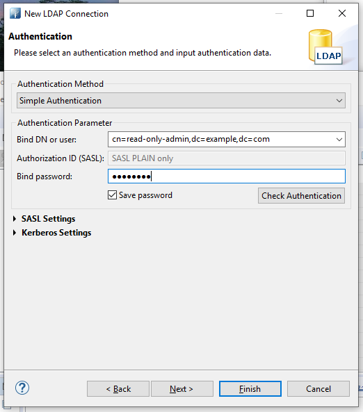

# Spring Boot LDAP example

## LDAP - Docker Image
You can use OpenLDAP docker image for testing 
* `https://hub.docker.com/r/osixia/openldap`
* `https://github.com/osixia/docker-openldap`
```
docker run -p 389:389 -p 636:636 --name my-openldap-container --detach osixia/openldap:1.3.0
```

## Application config

From Spring @Configuration

```java
    @Override
    protected void configure(HttpSecurity http) throws Exception {
        http
                .authorizeRequests()
                .antMatchers("/login**").permitAll()
                .antMatchers("/profile/**").fullyAuthenticated()
                .antMatchers("/").permitAll()
             .and()
        .formLogin()
                .loginPage("/login")
                .defaultSuccessUrl("/login-success")
                .failureUrl("/login?error")
                .permitAll()
                .and()
        .logout()
                .logoutSuccessUrl("/")
                .invalidateHttpSession(true)
                .deleteCookies("JSESSIONID");
    }

    @Override
    protected void configure(AuthenticationManagerBuilder auth) throws Exception {
        auth
                .ldapAuthentication()
                .contextSource(ldapContextSource())
                .userDnPatterns("uid={0}");
    }

    @Bean
    public LdapContextSource ldapContextSource(){
        LdapContextSource ctxSrc = new LdapContextSource();
        ctxSrc.setUrl("ldap://192.168.99.100:389");
        ctxSrc.setBase("dc=example,dc=org");
        ctxSrc.setUserDn("cn=admin,dc=example,dc=org");
        ctxSrc.setPassword("admin");

        return ctxSrc;
    }

    @Bean
    public LdapTemplate ldapTemplate(){
        return new LdapTemplate(ldapContextSource());
    }
```

```java
    LdapQuery query = query()
            .attributes("cn","sn","mail")          // Attributes you want to get
            .base(LdapUtils.emptyLdapName())
            .where("uid")                 // Query field name
            .is(p.getName());                      // Query value
    List<Person> result = ldapTemplate.search( query, new PersonAttributesMapper() );
    Person person = result.get(0);
```

## LDAP Browser
You can download LDAP Browser from the following link.
https://directory.apache.org/studio/

### Using Docker LDAP Server
Refer the screen shot below (Free Online)
* Hostname: 192.168.99.100
* Port: 389
* Bind DN or user: cn=admin,dc=example,dc=org
* Bind password: admin
> Then click on 'Fech Bind DNs' and 'Finish'

#### Adding new account Docker Server
* Create a SSHA encrypted password
The following command will generate the word 'password' in SSHA encryption
`docker exec my-openldap-container slappasswd -s password`
    * {SSHA}CW10yCh3RqsT00Jd58nmpW6zAkRI4E+V

* Create a LDIF file (something adam.ldif) to add user to LDAP server
```
dn: uid=adam,dc=example,dc=org
objectClass: top
objectClass: person
objectClass: posixAccount
objectClass: shadowAccount
cn: Adam Savage
sn: Savage
mail: adam.savage@aaa.com
uid: adam
uidNumber: 16859
gidNumber: 100
homeDirectory: /home/adam
loginShell: /bin/bash
gecos: adam
userPassword: {SSHA}CW10yCh3RqsT00Jd58nmpW6zAkRI4E+V
shadowLastChange: 0
shadowMax: 0
shadowWarning: 0
```

* Then import the above LDIF file to LDAP Server
    * This is easiest way to add new account LDAP

#### Application

* Default Index screen


* Login Screen


* Profile screen after logged in


#### Using Free Online LDAP Server 
* Open the app and click on the 'LDAP' icon.


* Enter the LDAP Server info then 'Next'


* Enter user and password then 'Next'



* Click on the button "Fetch Base DNs" then "Next"


* Click 'Finish'


* You can see ther LDAP Server and Entries


## For Multiple LDAP Servers
Create a LdapTemplate as required
```java
private LdapTemplate getLdapTemplateFromDocker() {

    LdapContextSource ctxSrc = new LdapContextSource();
    ctxSrc.setUrl("ldap://192.168.99.100:389");
    ctxSrc.setBase("dc=example,dc=org");
    ctxSrc.setUserDn("cn=admin,dc=example,dc=org");
    ctxSrc.setPassword("admin");
    ctxSrc.afterPropertiesSet();    // Initializing LdapContextSource

    return new LdapTemplate(ctxSrc);
}
```

## Referrances
* [https://spring.io/guides/gs/authenticating-ldap/](https://spring.io/guides/gs/authenticating-ldap/)
* [https://docs.spring.io/spring-ldap/docs/current/reference/](https://docs.spring.io/spring-ldap/docs/current/reference/)
* [https://www.baeldung.com/spring-ldap](https://www.baeldung.com/spring-ldap)
* [https://www.opencodez.com/java/configure-ldap-authentication-using-spring-boot.htm](https://www.opencodez.com/java/configure-ldap-authentication-using-spring-boot.htm)
* [https://memorynotfound.com/spring-boot-spring-ldap-advanced-ldap-queries-example/](https://memorynotfound.com/spring-boot-spring-ldap-advanced-ldap-queries-example/)
* [https://stackoverflow.com/questions/25515345/best-practice-for-configuring-spring-ldaptemplate-via-annotations-instead-of-xml/53474188](https://stackoverflow.com/questions/25515345/best-practice-for-configuring-spring-ldaptemplate-via-annotations-instead-of-xml/53474188)
* Free Online LDAP server [https://www.forumsys.com/tutorials/integration-how-to/ldap/online-ldap-test-server/](https://www.forumsys.com/tutorials/integration-how-to/ldap/online-ldap-test-server/)
